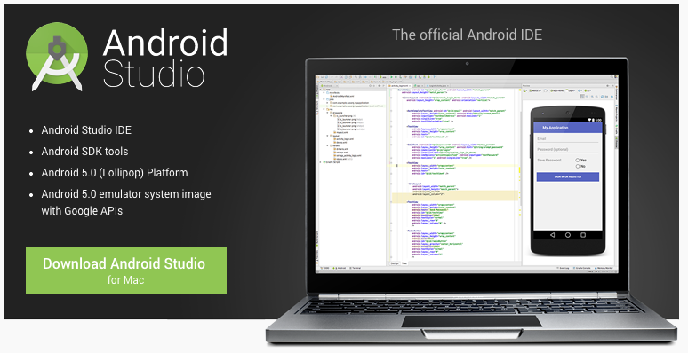

## Android Studio 权威教程

Android Studio 是一个Android开发环境，基于IntelliJ IDEA. 类似 Eclipse ADT，Android Studio 提供了集成的 Android 开发工具用于开发和调试。

鉴于Android Studio发布不久，网上可参考的资料很少，仅有的一些资料还存在版本成旧，编写错误等各种各样的问题，于是我们准备撰写一套完整的《Android Studio 权威教程》，并持续的更新和完善，让其成为每一个Android Studio 使用者不可或缺的参考文档，让大家少走弯路。

ps.
本篇权威教程还在不断完善，欢迎每一个人参与贡献。